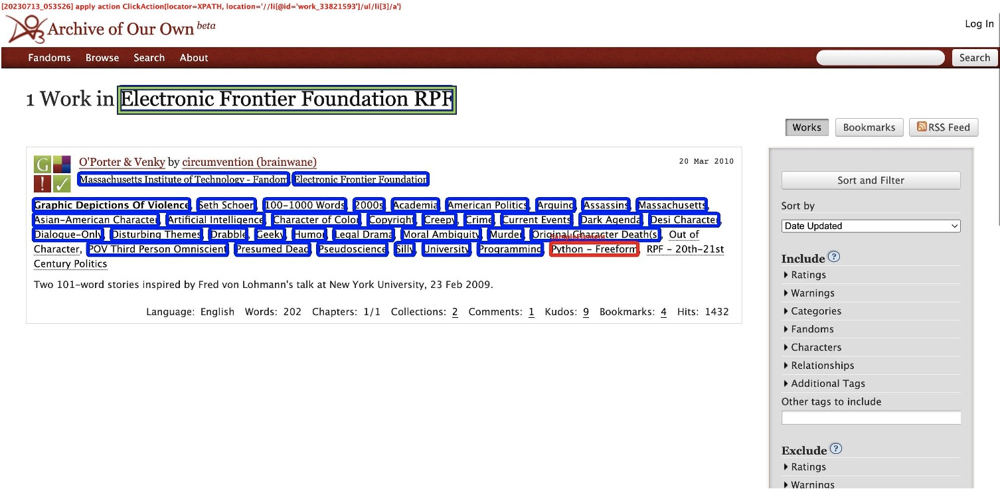

This dictionary contains 4 web applications that have false positive similar elements. Each figure here shows the state false positive element appears.

The blue box covered similar elements Fret found.

The red box covered the example element Fret use (for some web pages, the example element they used is in another state, so the screenshot has no red box).

The green box covered false positive elements.

 